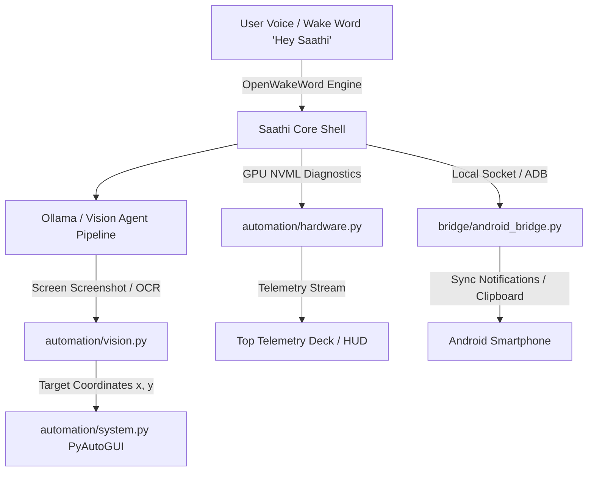

# Saathi AI — Next Phase Technical Blueprint & Implementation Plan
### Phase 7: Multimodal Screen Perception, Wake-Word Engine & Hardware Telemetry Sidecar
### Author & Lead Architect: **Pratham Prasad**
### Repository: `https://github.com/PrathamPrasad148/SaathiAI.git`

```text
================================================================================
              SAATHI AI — PHASE 7 NEXT PHASE DESCRIPTIVE BLUEPRINT
================================================================================
```

---

## 1. Executive Summary & Objectives

Following the completion of the **Cybernetic 3D/4D Vector Canvas**, **Airtight 4-Column HUD Layout**, and **Autonomous OS System Automation Engine**, **Phase 7** elevates Saathi AI into a fully aware, multimodal spatial intelligence assistant. 

This phase focuses on 4 key pillars:
1. **Multimodal Screen Perception & GUI Vision Intelligence** (`automation/vision.py`)
2. **On-Device Low-Power Wake-Word Detection Engine** (`voice/wakeword.py`)
3. **Hardware Telemetry & GPU Diagnostics Sidecar** (`automation/hardware.py`)
4. **Android Cross-Device Companion Bridge** (`bridge/android_bridge.py`)

---

## 2. Component Blueprint & Technical Specifications



---

### Pillar 1: Multimodal Screen Perception & GUI Vision Intelligence (`automation/vision.py`)

#### Objective:
Empower Saathi to "see" the user's active monitor in real-time, understand open application windows, extract visual text via OCR, detect clickable GUI buttons/icons, and perform visual automation without relying solely on keyboard shortcuts.

#### Key Features:
- **Fast Screen Capture Buffer**: High-performance screen grab via `pyautogui.screenshot()` / `PIL.ImageGrab` / `pywin32`.
- **Hybrid OCR & Vision Pipeline**:
  - Primary: Local lightweight vision model (`MiniCPM-V` or `Florence-2` via Ollama).
  - Secondary fallback: On-device `pytesseract` / `EasyOCR` for instant text-to-coordinate mapping.
- **Visual Target Finder (`find_element_on_screen(text_or_description) -> (x, y)`)**:
  - Locates text strings or UI icons (e.g., "Find the 'Log In' button") and returns exact screen coordinates `(x, y)` for `pyautogui.click(x, y)`.
- **Active Window Context Analyzer**:
  - Automatically reads the title, visual contents, and layout of whatever app the user is working in (Chrome, VS Code, Photoshop, CAD).

---

### Pillar 2: Ultra-Low Power On-Device Wake-Word Engine (`voice/wakeword.py`)

#### Objective:
Allow hands-free activation ("Hey Saathi" or "Saathi") running continuously in the background at **`< 1%` CPU idle**.

#### Key Features:
- **`openwakeword` Integration**: Lightweight ONNX-based wake-word detection model running on audio chunks captured by `pyaudio` / `sounddevice`.
- **Dynamic Acoustic Sensitivity**: Automatically adjusts noise floor threshold depending on ambient room noise.
- **HUD Visual Trigger**: Instant Arc Reactor core pulse illumination (`state = "LISTENING"`) when wake-word is detected.

---

### Pillar 3: Hardware Telemetry & GPU Diagnostics Sidecar (`automation/hardware.py`)

#### Objective:
Feed live NVIDIA GPU VRAM, GPU Core Temp, Fan Speed, and Power Draw into the top HUD telemetry bar alongside CPU/RAM metrics.

#### Key Features:
- **`pynvml` / `psutil` Integration**:
  - Reads NVIDIA GPU utilization %, VRAM used/total (GB), core temperature (°C), fan speed (RPM), and wattage.
- **HUD Deck Gauge Integration**:
  - Renders GPU load gauges in `ui/telemetry.py` and `ui/ai_core.py` (e.g., `GPU: RTX 3060 // 52°C // VRAM 4.2/12.0 GB`).

---

### Pillar 4: Android Companion Bridge & Cross-Device Sync (`bridge/android_bridge.py`)

#### Objective:
Provide secure local Wi-Fi & USB ADB synchronization between Windows Saathi AI and the user's Android smartphone.

#### Key Features:
- **Local Synchronous Socket Server**: Listens on local Wi-Fi port `8890` for encrypted messages from Saathi Android app.
- **Cross-Device Features**:
  - Incoming phone call & SMS alert popups inside Saathi HUD.
  - Bidirectional clipboard sharing (Copy on PC -> Paste on Phone, Copy on Phone -> Paste on PC).
  - Remote media control & battery percentage telemetry.

---

## 3. Directory Layout & File Structure (Phase 7)

```text
c:\SAATHIAI\
├── automation\
│   ├── system.py             # Existing OS automation (Mouse/Keyboard/Apps)
│   ├── engine.py             # Automation execution engine
│   ├── vision.py             # [NEW] Multimodal Screen Perception & OCR engine
│   └── hardware.py           # [NEW] GPU NVML & Hardware Telemetry sidecar
├── voice\
│   ├── stt.py                # Whisper STT engine
│   ├── tts.py                # Edge-TTS engine
│   └── wakeword.py           # [NEW] On-device 'Hey Saathi' Wake-Word listener
├── bridge\
│   └── android_bridge.py     # [NEW] Android Wi-Fi / USB synchronization bridge
├── agent\
│   ├── planner.py            # Cognitive planner & tool router
│   └── vision_agent.py       # [NEW] Autonomous visual UI interaction agent
├── Phase7_NextPhase_Blueprint.md  # [NEW] Descriptive Phase 7 Blueprint Specification
└── Tracker.md                # Roadmap milestone tracker
```

---

## 4. Phased Implementation Milestones & Timeline

| Step | Milestone | Key Deliverables | Estimated Target |
| :--- | :--- | :--- | :--- |
| **7.1** | **Vision Perception Core** | Implement `automation/vision.py` with fast screenshot buffer, OCR bounding box mapper, and `find_element_on_screen()` API. | Step 1 |
| **7.2** | **Visual Agent Tool Integration** | Expose vision tools (`take_screenshot_and_analyze`, `click_visual_text`) to Ollama cognitive loop in `agent/planner.py`. | Step 2 |
| **7.3** | **On-Device Wake-Word Engine** | Implement `voice/wakeword.py` using `openwakeword`, bind to `state = "LISTENING"` UI animation trigger. | Step 3 |
| **7.4** | **GPU Telemetry Sidecar** | Implement `automation/hardware.py` using `pynvml`, render GPU VRAM & temp telemetry in `ui/telemetry.py`. | Step 4 |
| **7.5** | **Android Companion Bridge** | Implement `bridge/android_bridge.py` socket listener for phone call/SMS alerts & clipboard sync. | Step 5 |

---

## 5. Verification & Testing Strategy

1. **Vision OCR Accuracy**: Verify `find_element_on_screen("Submit")` returns exact pixel coordinates matching onscreen target.
2. **Wake-Word Latency**: Measure wake-word detection response time (`< 300ms`) and idle CPU utilization (`< 1.0%`).
3. **GPU Telemetry Integrity**: Validate `pynvml` reporting matches `nvidia-smi` output.
4. **Build & Syntax Verification**: Execute `py -3.12 -m compileall` across all modules.
5. **Git Synchronization**: Deploy via `Push-ToGitHub.ps1`.

